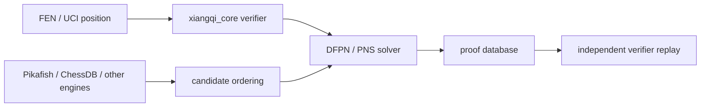

# Architecture

XQ Proof Lab is split into three proof-aware layers.

## 1. Canonical Verifier

`src/xiangqi_core` is the readable rules core. It owns:

- FEN parsing and serialization.
- Coordinate conversion.
- Legal move generation.
- Check, flying-general, stalemate, and game-result checks.
- UCI `position ... moves ...` replay through `GameState`.
- Conservative repetition metadata for checks, repeated-cycle move ranges, repeated attacks, legal chase-captures, and legal recaptures.
- Deterministic Zobrist hashing.

This layer is intentionally small and dependency-free so proof artifacts can be replayed independently.

## 2. Proof Search

`src/xiangqi_solver` starts with proof-number primitives and will grow toward DFPN/PNS:

- OR and AND node proof/disproof updates.
- Bounded AND/OR search for first proof artifacts.
- JSON proof artifacts that record FEN, target side, proof numbers, selected move, and child proof obligations.
- Replayable `position_command` and `history_signature` fields for history-sensitive proof states.
- Independent verifier replay before database writes.
- Independent verifier checks proof structure, replayed child positions, history-sensitive terminal rules, and proof/disproof numbers.
- Drawn child nodes are treated as refutations of a forced win target in parent proof-number aggregation.
- Transposition-aware proof states.
- Restartable frontier jobs with proof/disproof priority metadata.
- Proof artifact export.
- Independent replay verification.
- Store writes verify proof artifacts by default; unchecked writes are reserved for explicit corruption/negative tests.
- Frontier continuation can backfill result proof/disproof numbers and split expanded unknown parents into child frontier jobs.
- Parent artifact merging can restore stored expanded-unknown subtrees, so restartable runs do not lose intermediate frontier structure.
- A repeatable proof worker can run one proof target in small verified slices, automatically resuming the root artifact between rounds.
- Budgeted DFPN search distributes finite parent thresholds to child searches according to OR/AND proof-number aggregation.
- Iterative DFPN can rerun the same root with growing thresholds and report per-iteration proof/disproof numbers through single-position, proof-cycle, and batch workflows without weakening verifier checks.
- DFPN can reuse verified stored proofs and use them as child-ordering hints; command outputs expose cache and proof-store resolve counters for schedulers.

The solver must only mark a node proven when the verifier can replay the proof.

## 3. Engine Assistance

`src/xiangqi_evaluators` will hold adapters to external engines and heuristics:

- Pikafish UCI adapter.
- ChessDB cloud-book and endgame-tablebase adapter, including best-move source and DTC/DTM metric parameters.
- Candidate move ordering.
- Restartable proof-cycle and batch commands can use ChessDB or UCI engines for ordering while leaving proof certification to the local verifier; UCI ordering replays `position ... moves ...` history when it is available.
- Tactical check and checking-sequence search.
- Future tablebase or small-material exact databases.

These modules may reduce search work, but they never certify a proof by themselves.

## Data Flow

